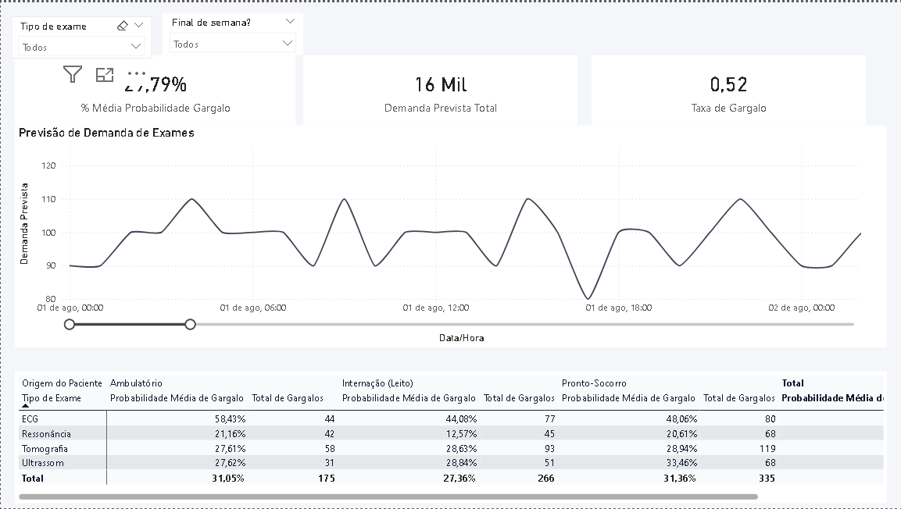
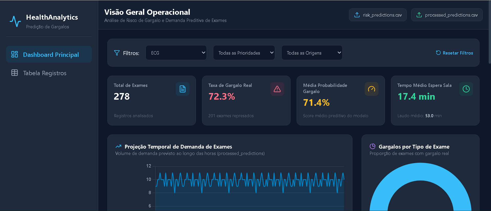

# 🏥 Previsão de Demanda, Monitoramento de Gargalos Hospitalares & Adoção de IA


## 📌 Visão Geral
Este projeto foi desenvolvido para otimizar o acompanhamento preditivo de demanda de exames e a identificação precoce de gargalos operacionais em setores críticos (Ambulatório, Internação e Pronto-Socorro).

A solução consolida métricas operacionais chave (KPIs), prevê oscilações temporais de volume, categoriza o risco por modalidade de exame (ECG, Ressonância, Tomografia e Ultrassom) e serve como ecossistema analítico para sustentação, validação e governança de soluções de Inteligência Artificial no contexto hospitalar.

---

## 🎯 Aderência a Projetos de Dados, Analytics e Adoção de IA
Este repositório atua diretamente na ponte entre a engenharia de dados tradicional e a aculturação/adoção de ferramentas de IA no ambiente assistencial:

1. **Acompanhamento de Métrica e Engajamento:** Estruturação de dados relacionais e métricas em Power BI/DAX para monitorar a adesão de equipes médicas a diagnósticos preditivos e ferramentas inteligentes.
2. **Avaliação do Impacto de Soluções Preditivas:** Mensuração do tempo economizado e mitigação de filas operacionais após a introdução de modelos de IA no fluxo de triagem.
3. **Maturidade Digital e Validação Funcional:** Suporte ao diagnóstico de maturidade de uso das ferramentas analíticas pelos usuários finais (médicos, enfermeiros e equipes administrativas), servindo de base para testes, validações e documentação de casos de uso.

---

## 🌐 Demonstração ao Vivo (Web Dashboard)

👉 **[Acessar o Dashboard Web Interativo](https://jj-lxxvi.github.io/hospital-flow-analytics/dashboard/)**

---

## 📸 Interface do Painel

> **Dashboard realizado no Power BI**  
> 

> **Dashboard Web realizado com HTML5, CSS3 (Tailwind CSS) e JavaScript (ES6+)**  
> 

---

## 📊 Estrutura e Indicadores

### 1. KPIs Principais (Cabeçalho)
* **% Média Probabilidade Gargalo:** Probabilidade percentual consolidada de ocorrência de gargalos operacionais.
* **Demanda Prevista Total:** Volume absoluto de exames projetados para o período selecionado.
* **Taxa de Gargalo:** Índice de severidade de sobrecarga nos setores operacionais.

### 2. Análise Temporal (Gráfico de Linhas)
* **Previsão de Demanda Temporal:** Acompanhamento fluido da oscilação de exames ao longo dos dias/horas.
* **Comportamento Preditivo:** Leitura contínua de picos operacionais para apoio ao dimensionamento de equipe, salas de exame e alocação de modelos preditivos de suporte à decisão.

### 3. Matriz de Gargalos Reais vs. Probabilidade
* **Cruzamento por Origem e Exame:** Detalhamento da probabilidade e contagem real de gargalos segmentado por:
  * **Ambulatório**
  * **Internação (Leito)**
  * **Pronto-Socorro**
* **Tipos de Exame:** ECG, Ressonância, Tomografia e Ultrassom.

---

## 🎛️ Filtros Interativos (Slicers)
* **Tipo de Exame (`tipo_exame`):** Filtro dinâmico por modalidade diagnóstica.
* **Final de Semana (`is_final_semana`):** Segmentação de comportamento operacional para dias úteis vs. fins de semana/plantões.

---

## 🛠️ Tecnologias Utilizadas
* **Microsoft Power BI Desktop:** Construção do modelo de dados, layout de UI/UX e visualizações.
* **DAX (Data Analysis Expressions):** Criação de medidas agregadoras, cálculo de probabilidade e métricas de demanda.
* **Python & SQL:** Modelagem de dados relacionais, tratamento de bases de uso e pipeline do modelo preditivo.
* **Web Frontend (HTML5 / Tailwind CSS / Chart.js):** Interface interativa desenvolvida para navegação fluida diretamente via navegador.

---

## 🚀 Como Executar o Projeto

1. Faça o clone ou download deste repositório:
   ```bash
   git clone [https://github.com/JJ-LXXVI/hospital-flow-analytics.git](https://github.com/JJ-LXXVI/hospital-flow-analytics.git)
